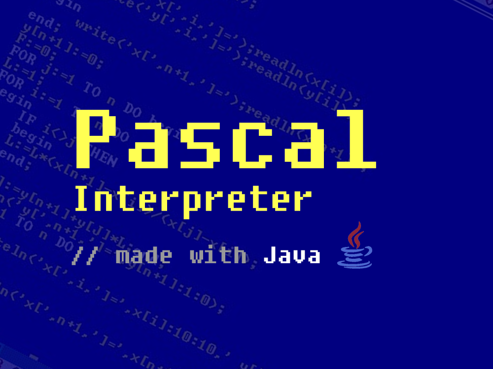

# Pascal Interpreter
    
[Pascal](https://en.wikipedia.org/wiki/Pascal_(programming_language)) Interpreter that can interpret three basic programming constructs and fully made using Java.

> 💪 Most challenging project in Data Structure course 2019 - iSTTS

## Background
[Data Structure](https://en.wikipedia.org/wiki/Data_structure) (DS) is one of the most important subjects in programming. Without a proper usage of data structure, a codebase can be very messy and unefficient. To make students understand the importance and usage of data structure, lecturer gave students a list of project and asked student to choose based on student capabilities. One of the hardest and the most challenging one is Pascal Interpreter that can interpret three basic programming constructs. So in order to challenge myself and get most of the DS course, I pushed myself and took that challenge.

## Supports
- Variable declaration
- Integer, Float, String Datatypes
- Assignment
- Arithmetic operators (+,-,*,/,%,^)
- Selection / Branching IF, IF ELSE
- Iteration (WHILE, REPEAT WHILE, FOR TO, FOR DOWNTO)
- Nested Block

_notes: you can view syntax examples in PascalInterpreter/PascalProject/ directory._

## Software & Library requirement
This is recommended tools and software to run this project.
- [Netbeans IDE](https://netbeans.apache.org/)
- [JDK 17](https://www.oracle.com/java/technologies/downloads/#java17)
- [JUnit 4](https://junit.org/junit4/)
- [Hamcrest 1.3](http://hamcrest.org/JavaHamcrest/)  

_notes: JUnit 4 and Hamcrest are available in Netbeans so you can install it directly in netbeans._

## How to Run
1. clone / download this project
2. open **PascalInterpreter** directory in Netbeans
3. build and run project